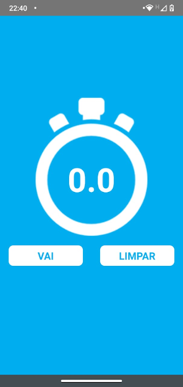
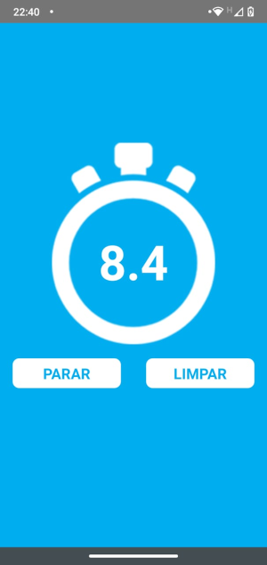
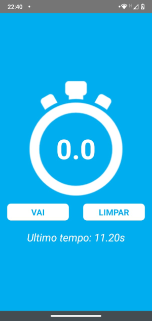

## Cronômetro em React-Native

## Screenshots

 

## Objetivo

Aplicar o aprendizado diário com aplicações simples, utilizando props, state, setStates, setInterval, clearInterval entre outros.

## Instalação

Você precisará ter apenas o [NodeJS](https://nodejs.org) instalado na sua máquina, e após isso, clonar este repositório:

```bash
$ git clone https://github.com/leandross86/cronometro_ReactNative.git
```
Depois disso acesse diretório
```bash
$ cd cronometro
```
Instale as dependências executando o seguinte comando:
```sh
$ yarn install # ou npm install
```
Instalando o App
```sh
npx react-native run-android
```
Iniciar o server
```sh
yarn start
```


### Status: Em desenvolvimento

Desenvolvido com ❤ por Leandro Souza